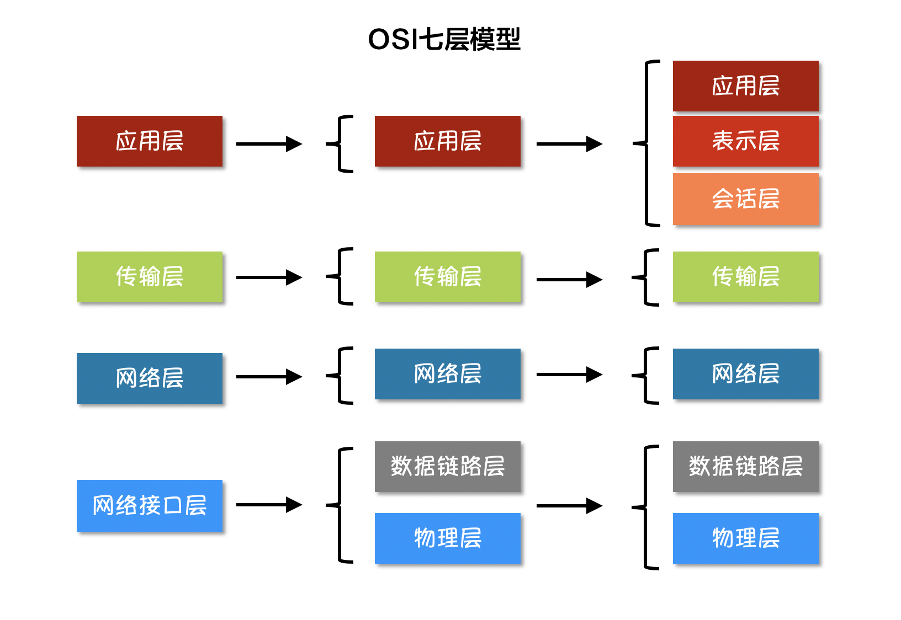

# Go 网络编程

### 目录

- [一、计算机网络体系结构](#一计算机网络体系结构)
  - [1.1 物理层](#11-物理层)
  - [1.2 数据链路层](#12-数据链路层)
  - [1.3 网络层](#13-网络层)
  - [1.4 传输层](#14-传输层)
  - [1.5 应用层](#15-应用层)
- [二、Socket编程](#二socket编程)
  - [2.1 TCP通信](#21-tcp通信)
  - [2.2 UDP通信](#22-udp通信)

---

## 一、计算机网络体系结构

<div align=center>

</div>


### 1.1 物理层

物理层：考虑的是怎么样在传输媒体中传输比特流，尽可能的屏蔽传输媒体和传输手段的差异，使数据链路层感觉不到差异。

根据信息在传输线上的方向，分为三种通信方式：

- 单工通信：单向传输
- 半双工通信：双向交替传输
- 全双工通信：双向同时传输

### 1.2 数据链路层

数据链路层：网络层是针对主机之间的数据传输，而两个主机之间有很多链路，数据链路层协议就是为同一链路的主机提供数据传输服务，数据链路层把网络层传下来的分组封装成帧。

信道分类：

- 广播信道：一对多通信，一个节点发送的数据能够被广播到所有节点。
- 点对点信道：一对一通信。

mac地址是链路层地址，长度为6个字节。

该层协议：ARP。

### 1.3 网络层

网络层：为主机提供传输服务；它把传输层传递下来的报文段或者用户数据报封装成分组。

该层协议：IP。

### 1.4 传输层

传输层：为进程提供传输服务；运输层包括两种协议：传输控制协议TCP，提供面向连接、可靠的数据传输服务，数据单位为报文段；用户数据协议UDP，提供无连接、尽最大努力的数据传输服务，单位为用户数据报。TCP提供完整性服务，UDP提供及时性服务。

该层协议：TCP、UDP。

### 1.5 应用层

应用层：为特定应用程序提供数据传输服务，如HTTP等，数据单位为报文。

该层协议：HTTP。

## 二、Socket编程
Socket是BSD UNIX的进程通信机制，通常也称作”套接字”，用于描述IP地址和端口，是一个通信链的句柄。Socket可以理解为TCP/IP网络的API，它定义了许多函数或例程，程序员可以用它们来开发TCP/IP网络上的应用程序。电脑上运行的应用程序通常通过”套接字”向网络发出请求或者应答网络请求。 

`Socket`是应用层与TCP/IP协议族通信的中间软件抽象层。它把复杂的TCP/IP协议族隐藏在`Socket`后面用户来说只需要调用Socket规定的相关函数，让`Socket`去组织符合指定的协议数据然后进行通信。 

### 2.1 TCP通信

#### TCP 协议

TCP/IP(Transmission Control Protocol/Internet Protocol) 传输控制协议/网间协议，是一种面向连接的、可靠的数据传输服务，基于字节流的传输层通信协议。

#### TCP 服务端

一个  TCP服务端可以同时连接很多个客户端。因为Go语言中创建多个goroutine实现并发非常方便和高效，所以可以每建立一次链接就创建一个goroutine去处理。

TCP 服务端程序的处理流程：

1. 监听IP和端口
2. 接收客户端请求建立链接
3. 创建 goroutine 处理客户端请求

TCP 服务端代码：

```go
// tcp/server/main.go

package main

import (
	"bufio"
	"fmt"
	"log"
	"net"
)


// 连接处理
func handleConn(conn net.Conn) {
	defer conn.Close()

	reader := bufio.NewReader(conn)
	var buf = make([]byte, 1024)

	for {
		n, err := reader.Read(buf)

		if err != nil {
			log.Println("read from client failed, err:", err)
			break
		}

		fmt.Println("client发送数据：", string(buf[:n]))
		conn.Write(buf[:n])
	}
}

func main() {
	network := "tcp"	// 协议
	address := "127.0.0.1:8080"	// 监听 ip 地址和 8080 端口
	listener, err := net.Listen(network, address)	// 监听
	if err != nil {
		log.Fatalln("listen failed, err:", err)
	}
	defer listener.Close()

	for {
		conn, err := listener.Accept()	// 接收连接
		if err != nil {
			log.Println("accept failed, err:", err)
			continue
		}
		go handleConn(conn)	// 开启协程处理连接
	}
}
```

#### TCP 客户端

TCP 客户端程序的处理流程：

1. 建立与服务端的链接
2. 进行数据收发
3. 关闭链接

TCP 客户端代码：

```go
// tcp/client/main.go

package main

import (
	"bufio"
	"fmt"
	"net"
	"os"
	"strings"
)

func main() {
	conn, err := net.Dial("tcp", "127.0.0.1:8080")	// 发送连接请求
	if err != nil {
		fmt.Println("dial failed, err:", err)
		return
	}
	defer conn.Close()

	inputStdin := bufio.NewReader(os.Stdin)
	for {
		line, _ := inputStdin.ReadString('\n')
		lineInfo := strings.Trim(line, "\r\n")
		if strings.ToLower(lineInfo) == "q" {
			return
		}

		_, err := conn.Write([]byte(line))	// 向服务端发送数据
		if err != nil {
			return
		}

		var buf = make([]byte, len(line))
		n, err := conn.Read(buf)

		if err != nil {
			fmt.Println("recv failed, err:", err)
			return
		}
		fmt.Println("server 发来数据：",string(buf[:n]))
	}
}

```

### 2.2 UDP通信

#### UDP 协议

UDP (User Datagram Protocol) 用户数据报协议，无连接、不可靠的通信服务，尽最大努力传输数据，UDP协议的实时性比较好，通常用于视频直播相关领域。 

### UDP 服务端

```go
// udp/server/main.go

package main

import (
	"fmt"
	"log"
	"net"
)

func main() {
	listen, err := net.ListenUDP("udp", &net.UDPAddr{
		IP:   net.IPv4(0, 0, 0, 0),
		Port: 8080,
	})
	if err != nil {
		log.Fatalln("listen failed, err:", err)
	}
	defer listen.Close()

	for {
		var data [1024]byte
		n, addr, err := listen.ReadFromUDP(data[:])
		if err != nil {
			log.Println("Read From UDP failed, err:", err)
			continue
		}

		fmt.Printf("data:%v addr:%v count:%v\n", string(data[:n]), addr, n)
		_, err = listen.WriteToUDP(data[:n], addr) // 发送数据
		if err != nil {
			fmt.Println("write to udp failed, err:", err)
			continue
		}
	}
}
```

#### UDP 客户端

```go
// udp/client/main.go

package main

import (
	"fmt"
	"net"
)

func main() {
	socket, err := net.DialUDP("udp", nil, &net.UDPAddr{
		IP:   net.IPv4(0, 0, 0, 0),
		Port: 8080,
	})
	if err != nil {
		fmt.Println("连接服务端失败，err:", err)
		return
	}
	defer socket.Close()
	sendData := []byte("Hello server")
	_, err = socket.Write(sendData) // 发送数据
	if err != nil {
		fmt.Println("发送数据失败，err:", err)
		return
	}
	data := make([]byte, 4096)
	n, remoteAddr, err := socket.ReadFromUDP(data) // 接收数据
	if err != nil {
		fmt.Println("接收数据失败，err:", err)
		return
	}
	fmt.Printf("recv:%v addr:%v count:%v\n", string(data[:n]), remoteAddr, n)
}
```


### License

MIT License GoodCoder-Notes，转载请注明出处。